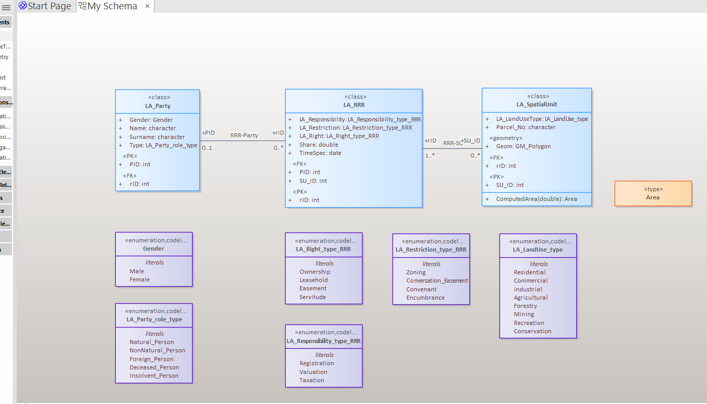
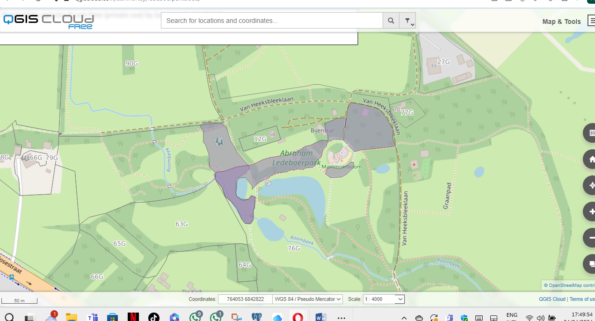
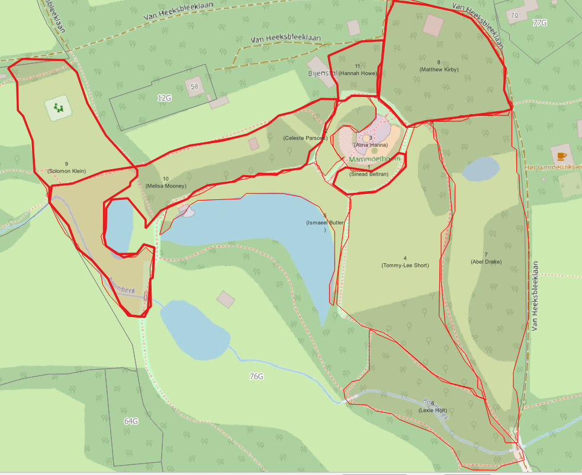
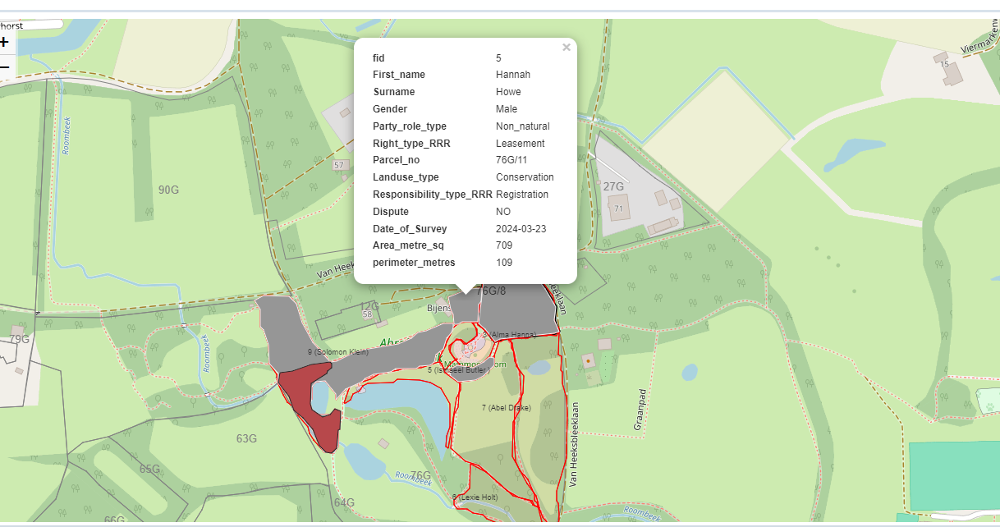
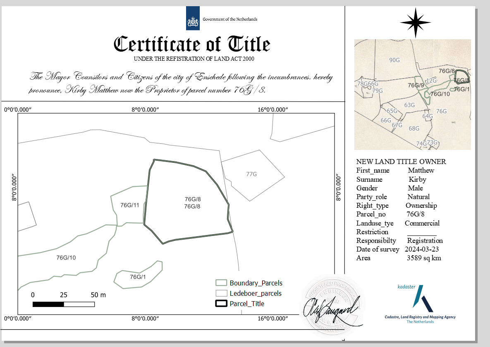

# Land Dispute Workflow Automation

This project demonstrates a cloud GIS and workflow automation prototype for land dispute and lease application processing. It was developed as an academic land administration exercise at the University of Twente.

The repository contains a ProcessMaker/WFMS workflow export, digital form definitions, supporting documentation, and saved interface evidence showing the workflow design environment.

## Project Objectives

- Design a digital workflow for land dispute complaint handling.
- Model lease and land administration application forms.
- Connect form-based workflows with web map interaction.
- Use OpenLayers and OGC web services to support area-of-interest selection and lot identification.
- Support structured review steps including survey, recommendation, accountancy, record update, and final outcome.

## Repository Structure

```text
.
├── workflow/                 # ProcessMaker/WFMS exported workflow package
├── forms/
│   ├── land-dispute/         # Land dispute workflow form definitions
│   └── lease/                # Lease workflow form definitions
├── docs/                     # Workflow report and assignment documentation
├── evidence/
│   └── wfms-page/            # Saved WFMS designer page evidence
├── results/
│   └── figures/              # Screenshots and cartographic outputs
└── README.md
```

## Main Components

- `workflow/land-dispute-processmaker-export.pmx`: exported ProcessMaker/WFMS workflow package.
- `forms/land-dispute/`: JSON form definitions for complaint intake, survey review, recommendation, accountancy, outcome, and record update stages.
- `forms/lease/`: JSON form definitions for lease application, analysis, survey, and lot allocation.
- `docs/workflow-summary.md`: concise explanation of the workflow logic.
- `evidence/wfms-page/wfms-designer-page.html`: saved evidence of the WFMS/ProcessMaker designer environment.
- `results/figures/`: selected visual outputs showing the data model, web GIS interface, parcel claims, popup attributes, and title certificate output.

## Workflow Logic

The workflow begins when an applicant submits a land dispute complaint or lease application. The intake form captures identity, contact, parcel, title, dispute, and supporting-document information. A map panel allows the user to interact with spatial layers, identify a lot or area of interest, and pass selected map attributes into workflow form fields.

The back-office stages then support survey review, administrative recommendation, accountancy checks, record updates, and final outcome documentation.

## GIS and Cloud Integration

The workflow uses OpenLayers inside a digital form to connect with OGC services. The form script references WMS/WFS-style services for city, district, and lot layers, allowing cadastral or administrative features to be selected in the browser and used inside the workflow.

This demonstrates how land administration workflows can combine:

- Digital case intake
- Web GIS interaction
- Parcel/lot selection
- Spatially enabled decision support
- Structured back-office processing

## Figures and Interpretation

### LADM-Inspired Cadastral Data Model



This model organizes the land administration data around parties, rights/restrictions/responsibilities, and spatial units. It shows how parcel records, ownership rights, land-use categories, and registration responsibilities can be structured before being used in a workflow or GIS database.

### Cloud GIS Parcel View



This figure shows the cadastral layers viewed through a cloud GIS interface. It demonstrates how parcel boundaries and related features can be made accessible through the web for review by users who may not work directly inside desktop GIS software.

### Parcel Claims and Boundary Review



This map shows new land claims over existing parcel geometry. The overlap and boundary relationships are important because they support the dispute workflow: a case officer or survey reviewer can identify where claims intersect, conflict, or require further investigation.

### Interactive Parcel Attribute Popup



The popup demonstrates how parcel/title attributes can be inspected interactively. Attributes such as parcel number, right type, land-use type, dispute status, survey date, area, and perimeter support evidence-based review during the workflow.

### Certificate of Title Output



The certificate output shows the final cartographic product generated from the cadastral data. It connects the workflow result to an official-style title record, combining parcel geometry, ownership/right information, and map layout elements.

## Tools and Technologies

- ProcessMaker/WFMS
- OpenLayers
- OGC WMS/WFS services
- JavaScript
- JSON form definitions
- Cloud GIS concepts
- Land administration workflow design

## Reproducibility

To inspect the project:

1. Review `docs/workflow-summary.md` for the process overview.
2. Inspect the JSON form definitions in `forms/`.
3. Import `workflow/land-dispute-processmaker-export.pmx` into a compatible ProcessMaker/WFMS environment.
4. Open `evidence/wfms-page/wfms-designer-page.html` to view saved evidence of the workflow designer page.
5. Review the academic report in `docs/` for the broader assignment context.

## Note

All forms, names, parcel references, and records in this repository are instructional/demo materials used for academic purposes.
